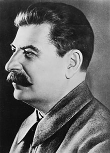

# Curriculum de vida 

#### Nombre: 
Iósif Vissariónovich Dzhugashvili

#### Edad: 
55

#### Procedencia
Imperio Ruso 

#### Profesión: 
Lider politico 

#### Logros 
2° Guerra Mundial 

#### Imagen personal 
 

##### Experiencia laboral
- Soldadura 
- Pintura
- Carpinteria 
- Cortes de pelo 

##### Pruebas de que se labura 
 

